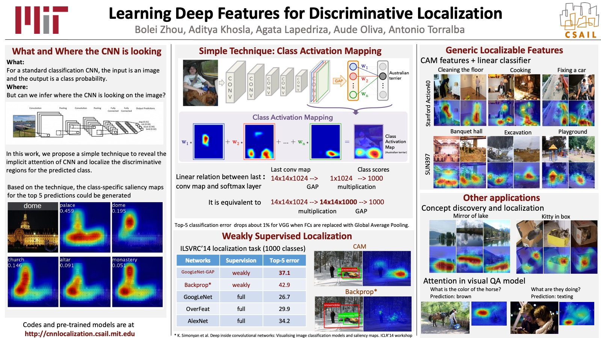
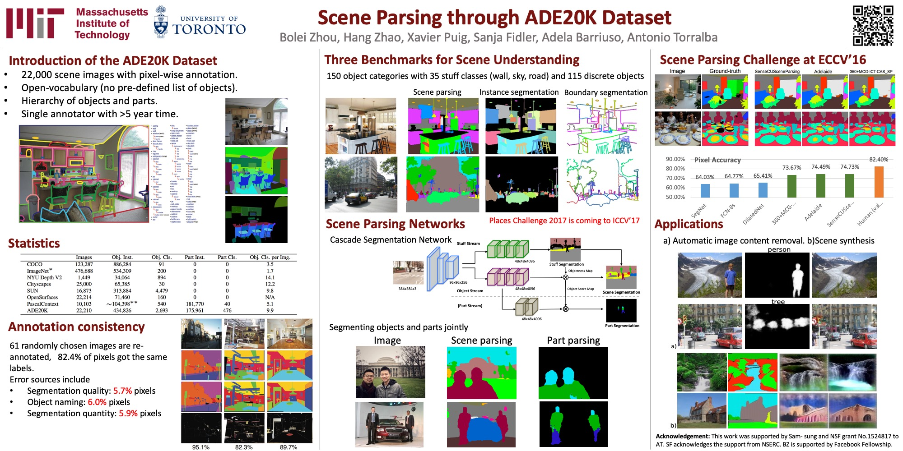
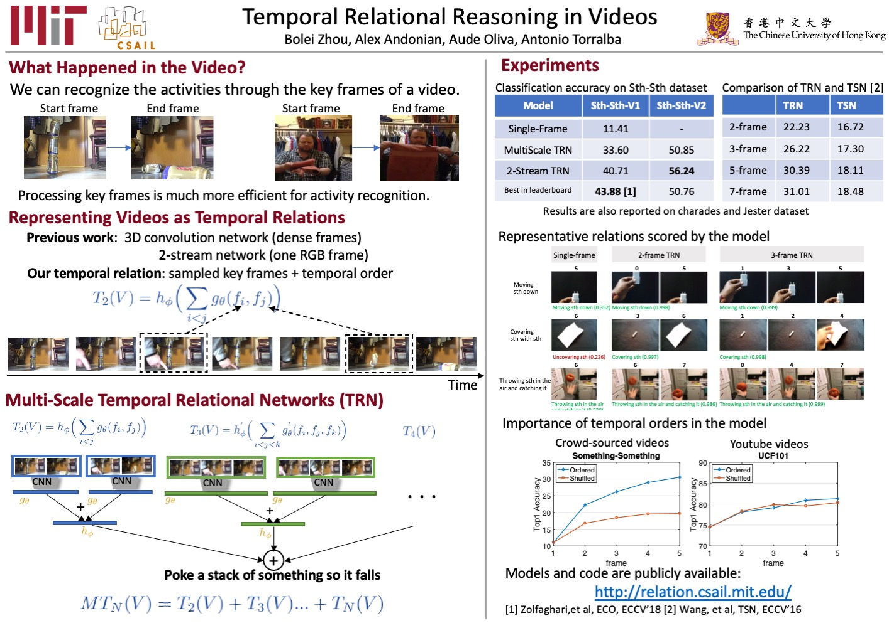
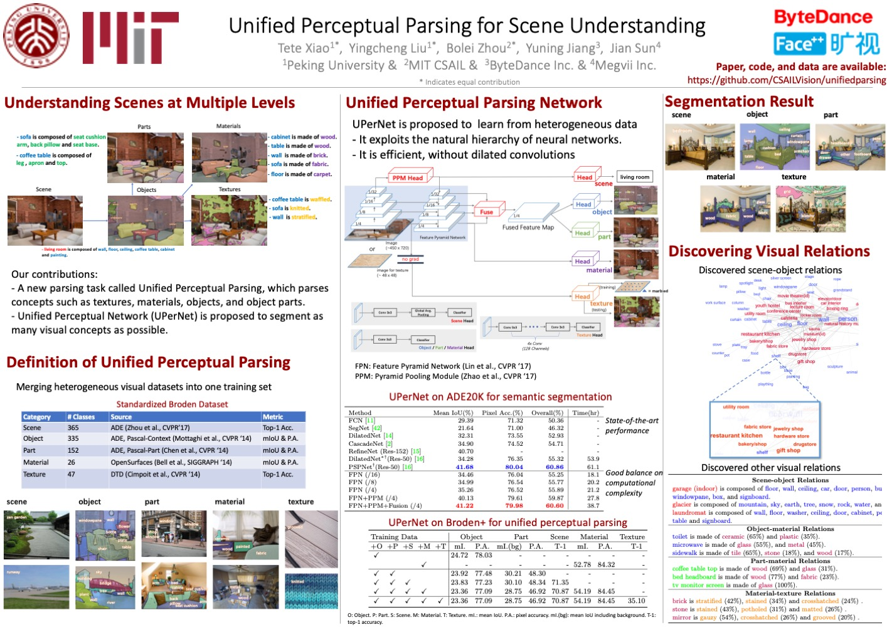
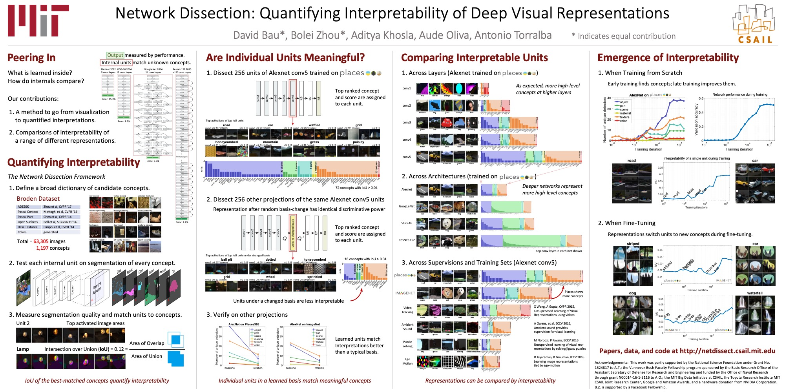
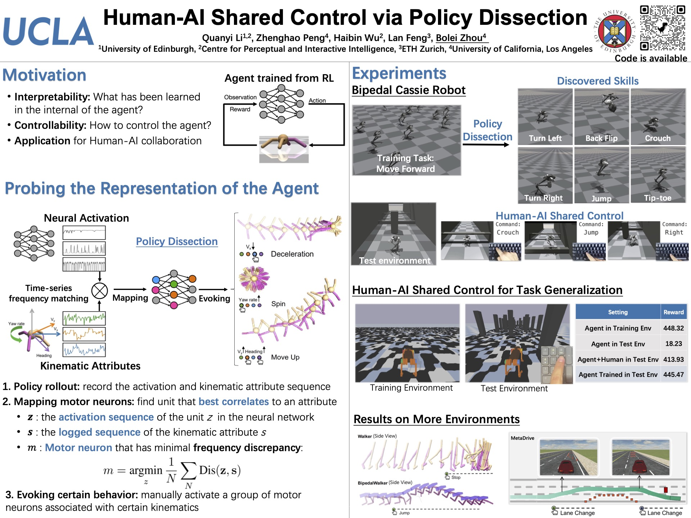
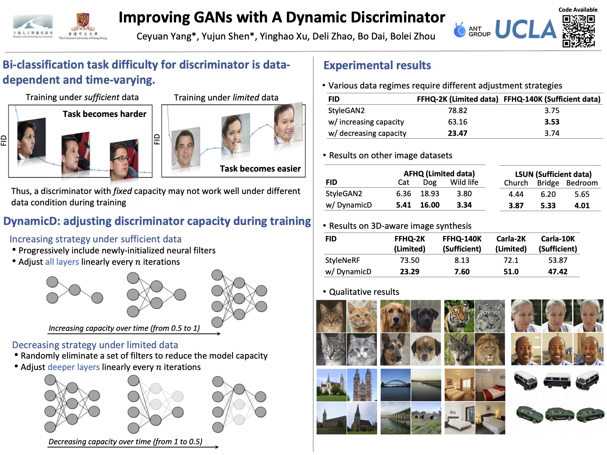

# Not so awesome academic posters

Here I share some acaemic posters I used over the years. They are not awesome but work, I survived the conference poster sessions. Feel free to start with them to build your own awesome posters. 

** A tip for poster presentations **: Think of the poster session as a crowded bazaar, where it is difficult for the audience to stop by and hear your awesome research patiently. So please try to make poster presentation concise and highlight the core contributions, so the audience will be interested in taking a note and read your paper back home. Ideally, you should finish presenting the poster in less than 5 min (I usually aim for 3 min), otherwise it will be too long. In that sense, you know how much content you should put in a poster. Good luck, and if you find this poster repo useful, say hi to me next time you meet me at any poster session! 

* Poster for CVPR'15 paper

[download pptx](poster_cvpr15_CAM.pptx?raw=true)

* Poster for CVPR'17 paper

[download pptx](poster_cvpr17_ade20k.pptx?raw=true)

* Poster for ECCV'18 paper

[download pptx](poster_eccv18_trn.pptx?raw=true)

* Poster for ECCV'18 paper. This poster is mainly designed by Tete. 

[download pptx](poster_eccv18_upernet.pptx?raw=true)

* Poster for CVPR'18 paper. This poster is mainly designed by David Bau. I think the font size is a bit small and the content is too dense.

[download pptx](http://netdissect.csail.mit.edu/poster/poster_v3.pptx)

* Poster for NeurIPS'22 paper (36x48).

[download pptx](poster_neurips22_policydissect.pptx?raw=true)

* Poster for NeurIPS'22 paper (36x48).

[download pptx](poster_neurips22_dynamicd.pptx?raw=true)

FYI: The posters above were presented at some conferences in person. So they used to be printed out with height as 1 meter. If you will present poster online like Gatherly, you might have to significantly increase the font size and reduce the density of the content!
